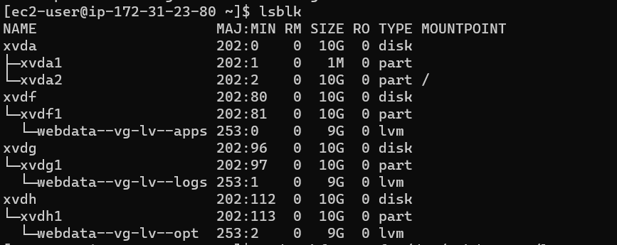

## DEVOPS TOOLING WEBSITE SOLUTION

# Step 1 - Preparing of NFS Server
>`lsbkl`

>`sudo yum install lvm2 -y`

>`sudo lvmdiskscan`

> `sudo pvcreate`

> `sudo lvcreate`

>`sudo vgcreate`

> ` sudo mkfs -t xfs /dev/webdata-vg/lv-apps`

>`sudo mkdir /mnt/apps`
 
>`sudo mkdir /mnt/logs`
 
>`sudo mkdir /mnt/opt`
 
>`sudo mount /dev/webdata-vg/lv-apps /mnt/apps`
 
>`sudo mount /dev/webdata-vg/lv-apps /mnt/logs`
 
> `sudo mount /dev/webdata-vg/lv-apps /mnt/opt`

> `sudo yum -y update`

>`sudo yum install nfs-utils -y`

> ` sudo systemctl start nfs-server.service`

> ` sudo chown -R nobody: /mnt/apps`

> `sudo chown -R nobody: /mnt/logs`

> `sudo chown -R nobody: /mnt/opt`

> `sudo chmod -R 777 /mnt/apps`

> `sudo chmod -R 777 /mnt/logs`

> ` sudo chmod -R 777 /mnt/opt`

> ` sudo vi /etc/exports`

> ` sudo exportfs -arv`

## STEP 2 — CONFIGURE THE DATABASE SERVER

> `Commands:`

> ` sudo apt install mysql-server`

> `sudo apt update`

> `sudo apt install mysql- server -y`

> `sudo mysql`

> ``

> ` sudo vi /etc/mysql/mysql.conf.d/mysqld.cnf`

> ` sudo systemctl restart mysql`

> ` sudo systemctl status mysql`

## STEP 3 - Preparing the Web Servers

> `Commands:`

> `sudo yum install nfs-utils nfs4-acl-tools -y`

> `sudo mkdir /var/www`

> `sudo mount -t nfs -o rw,nosuid <NFS-Server-Private-IP-Address>:/mnt/apps /var/www`

> `sudo vi /etc/fstab`

> `sudo yum install httpd -y`

> `sudo yum intstall git`

> `sudo yum install https://dl.fedoraproject.org/pub/epel/epel-release-latest-8.noarch.rpm -y`

> `sudo yum install yum-utils http://rpms.remirepo.net/enterprise/remi-release-8.rpm`

> `sudo yum module reset php`

> `sudo yum module enable php:remi-7.4`

> `sudo yum install php php-opcache php-gd php-curl php-mysqlnd`

> `sudo systemctl start php-fpm`

> `setsebool -P httpd_execmem 1`

